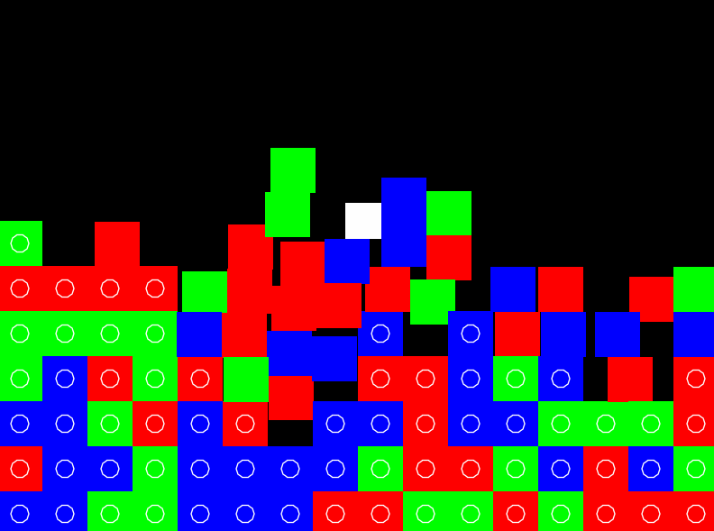

# throw-eliminate
A three-eliminate platformer

Controls:

Arrow keys: move and decide throw direction. do not try to use 'up' to jump.

Space: jump

S: Spawn a new tile

F: Hold to grab a tile, release to ... release

R: Reset

Goal:

Put 3 or more tiles together to clear them

There is no final goal currently

