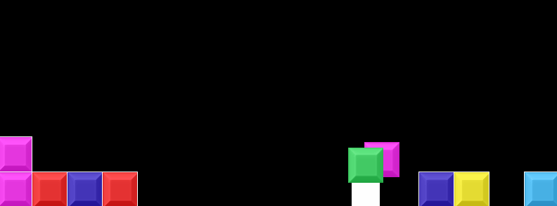

# throw-eliminate
A tile-matching platformer

---

**Controls:**

|Input|Usage|
|---|---|
|*Arrow keys*|move and decide throw direction|
|*Space*|jump|
|*S*|Spawn a new tile per press|
|*M*|Spawn a new tile per frame held|
|*F*|Hold to grab a tile, release to ... release|
|*R*|Reset|

**Goal:**

Put 3 or more tiles together to clear them

There is no final goal currently

